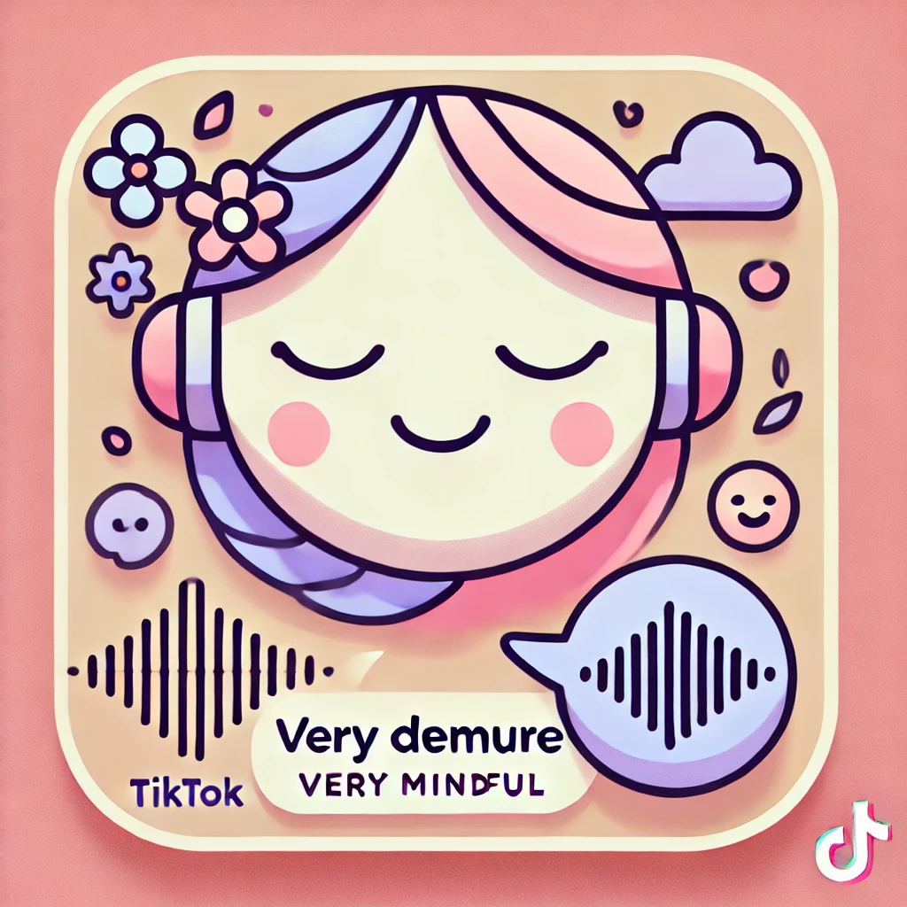
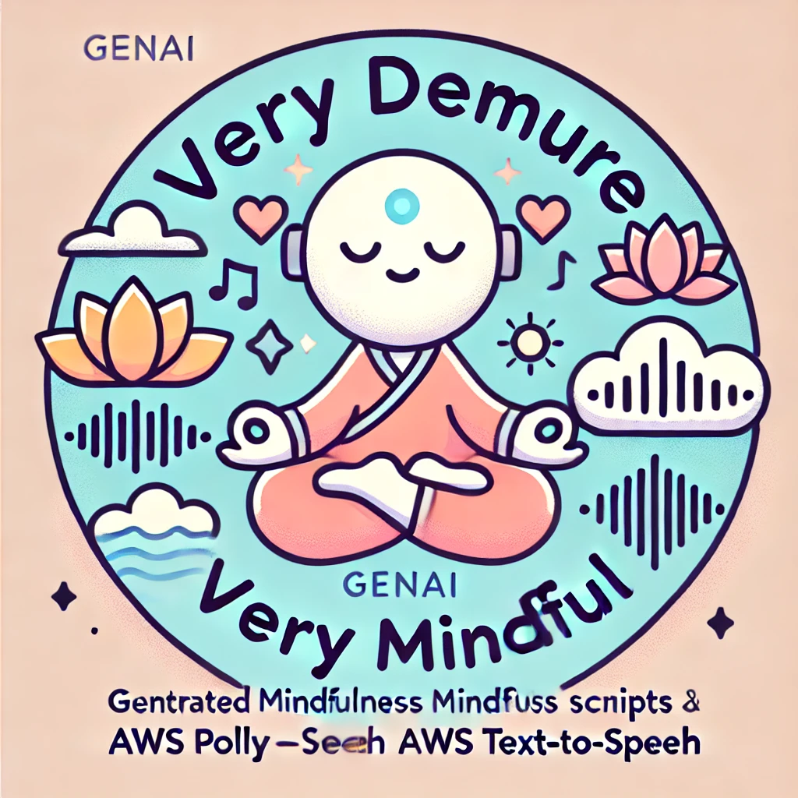

# Very Demure, Very Mindful

<div align="center">
    
    
    <p><i>Logo(s) generated by DALL-E and ChatGPT-4o</i></p>
</div>
The name is a play on a current TikTok trend.

# Motivation

After listening to this [podcast](https://brenebrown.com/podcast/finding-focus-and-owning-your-attention/) 
where Brené Brown interviews Dr Amishi Jha to dive into the distinction between _Focus_, _Attention_ and _Memory_, 
I have a renewed interest in my own mindfulness practices.

Dr. Gabor Mate writes in his book [Scattered Minds](https://drgabormate.com/book/scattered-minds/) about the importance 
of a mindfulness practice to help those with ADHD to manage and even reverse some of the attention deficit traits.

After trying a few different "mindfulness" apps, I wasn't convinced of their value with subscription pricing 
but could I have a more on-demand model? _**Turns out, yes I can.**_

# Roadmap

## Done

- get OpenAI to generate a guided mindfulness transcript
- get AWS Polly to use the text-to-speech to synthesize the audio.
- Add slower cadence and pauses. Leverage [SSML](https://docs.aws.amazon.com/polly/latest/dg/supportedtags.html)

# Quickstart

```sh
make dev

# Generate script for a "10 minute" session.
# TODO: Get the generated audio to actually pause with silence when cued.
python3 -m very_demure --duration 10 --voice Matthew

python3 -m http.server --directory docs
```

# Samples

Checkout an example transcript and MP3 in the [`docs/samples/`](docs/samples/) folder

